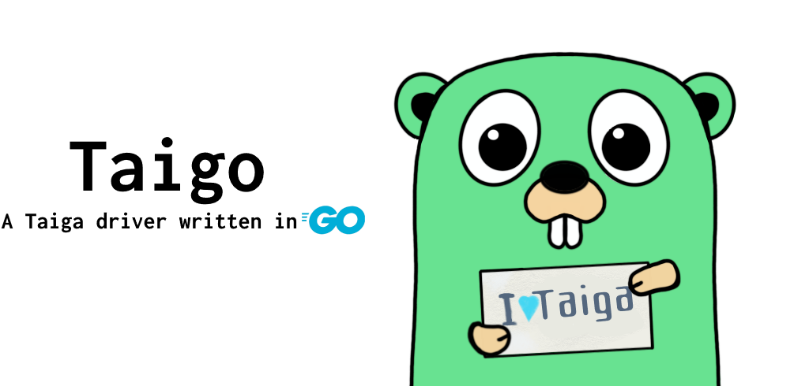

TAIGO
-----



# Description
**TAIGO** is a driver written in GO for [Taiga](https://github.com/taigaio) targeting to implement all publicly available API v1 endpoints. <br>
Taiga is an Agile, Free and Open Source Project Management Tool.

Should you have any ideas or recommendations, feel free to report it as an issue or open a pull request.

# Integration
To use **TAIGO**, in your project, first get the code: <br>
`go get github.com/theriverman/taigo/driver` <br>
 Then import it into your project: <br>
```go
import (
    taiga "github.com/theriverman/taigo/src"
)
```

# Documentation
Documentation is located here: [TAIGO](https://godoc.org/github.com/theriverman/taigo/)

# Architecture
To use **TAIGO**, you must instantiate a `*Client`, and as part of the process, you must provide an `httpClient` from `"net/http"`.<br>
All objects (*epic, user story, issue, task, sprint, etc...*) you may encounter in Taiga are represented in a struct type.<br>

## Meta System
Since the API endpoints of Taiga return various payloads for the same object types, a meta system has been added 
to simplify the interaction with the **TAIGO** APIs. <br>

For example, in Taiga the `http://localhost:8000/api/v1/userstories` base endpoint can return the following payload types:
  - User story detail
  - User story detail (GET)
  - User story detail (LIST)

The returned payload type depends on the executed action: list, create, edit, get, etc...

Since GO does not support generics and casting between different types is not a trivial operation, a generic
type has been introduced in **TAIGO** for each implemented Taiga object type, such as, Epic, Milestone, UserStory, Task, etc...

These generic types come with meta fields (pointers) to the originally returned payload.
In case you need access to a field *not* represented in the generic type provided by **TAIGO**, you can use the appropriate meta field.

For example, struct `Epic` has the following meta fields:

```go
type Epic struct {
    ID                int
    // ...
    EpicDetail        *EpicDetail
    EpicDetailGET     *EpicDetailGET
    EpicDetailLIST    *EpicDetailLIST
}
```

The available meta field is always stated in the operation's docstring as `Available Meta`, for example:
```go
// CreateEpic => https://taigaio.github.io/taiga-doc/dist/api.html#epics-create
//
// Available Meta: *EpicDetail
func (s *EpicService) Create(epic Epic) (*Epic, error) {}
```

## Docs-As-Code ( godoc / docstrings )
To avoid creating and maintaining a redundant API documentation for each covered Taiga API resource, 
the API behaviours and fields are **not** documented in **TAIGO**.
Instead, the docstring comment provides a direct URL to each appropriate online resource.<br>
**Example:**<br>
```go
// CreateEpic => https://taigaio.github.io/taiga-doc/dist/api.html#epics-create
func (s *EpicService) Create(epic Epic) (*Epic, error) {}
```

Upon opening that link, you can find out what fields are available through `*Epic`:
  > - project (required): project id <br>
  > - subject (required) 

To find out which operation requires what fields and what they return, always refer to the official 
[Taiga REST API](https://taigaio.github.io/taiga-doc/dist/api.html) documentation.

## Pagination
It is rarely useful to receive results paginated in a driver like **TAIGO**, so **pagination is disabled** by default. <br>

To enable pagination (for all future requests) set `Client.DisablePagination` to `false`: <br>
```go
// Enable pagination (disabled by default)
client.DisablePagination(false)
```

For details on Taiga's pagination, see [Taiga REST API / Pagination](https://taigaio.github.io/taiga-doc/dist/api.html#_pagination).

# Usage

## Client Instantiation
```go
package main

import (
  "fmt"
  "net/http"

  taiga "github.com/theriverman/taigo/gotaiga"
)
func main() {
	// Create client
	client := taiga.Client{
		BaseURL:    "https://api.taiga.io",
		HTTPClient: &http.Client{},
		LoginType:  "normal",
	}
	// Initialise client (authenticates to Taiga)
	err := client.Initialise(&taiga.Credentials{
		Type:     "normal",
		Username: "my_pretty_username",
		Password: "123123",
	})
	if err != nil {
		client.Logger.Fatalln(err)
	}
	// Set default project (optional. recommended for convenience)
	client.SetDefaultProjectBySlug("theriverman-test-1337")

	// Get /users/me
	me, _ := client.User.Me()
	fmt.Println("Me: (ID, Username, FullName)", me.ID, me.Username, me.FullName)

  // Get Project [ theriverman-api-dev-testing-1337 ]
	slug := "theriverman-api-dev-testing-1337"
	fmt.Printf("Getting Project (slug=%s)..\n", slug)
	project, err := client.Project.GetBySlug(slug)
	if err != nil {
		fmt.Println(err)
	}
	fmt.Printf("Project name: %s \n\n", project.Name)
}
```

## Basic Operations
```go
// get users/me
me, _ := client.User.Me()
fmt.Println("Me (ID, Username, FullName)", me.ID, me.Username, me.FullName)

// get all projects (no filtering, no ordering)
projectsList, _ := client.Project.List(nil)
for _, proj := range *projectsList {
    fmt.Println("Project ID:", proj.ID, "Project Name:", proj.Name)
}
/*
  ListProjects accepts a `*ProjectsQueryParameters` as an argument, but if you don't need any filtering,
  you can either pass nil or a pointer to an empty `*ProjectsQueryParameters` struct.
*/

// get all projects for user ID 1337
queryParams := taiga.Project.QueryParameters{
    Member: 1337,
}
queryParams.TotalFansLastMonth() // results are ordered by TotalFansLastMonth
projectsList, _ := client.Project.List(&queryParams)
for _, proj := range *projectsList {
    fmt.Println("Project ID:", proj.ID, "Project Name:", proj.Name)
}

// upload a file (Create an Epic attachment)
newAttachment, err := client.Epic.CreateAttachment(&taiga.Attachment{ObjectID: 1337, Project: 7331}, "C:/Users/theriverman/Pictures/nghfb.jpg")
```

## Advanced Operations (Non-Standard)
1. Clone Epic (with UserStories)
2. Clone Epic (without UserStories)
3. Clone UserStory (with sub-tasks)
4. Clone UserStory (without sub-tasks)
5. Clone Sub-Task
6. Copy UserStory to another project [will lose comments and attachments]

# Contribution
You're contribution would be much appreciated! <br>
Feel free to open Issue tickets or create Pull requests. <br>

Should you have an idea which would cause non-backward compatibility, please open an issue first to discuss your proposal!


## Branching Strategy
This package conforms to the stable HEAD philosophy.
  * **master** is <i>always</i> stable
  * **develop** is *not* <i>always</i> stable

# Licenses & Recognitions
| Product                   | License |                                                        |
|---------------------------|---------|--------------------------------------------------------|
| **Go Gopher**             | CC3.0   | [Renee French](https://www.instagram.com/reneefrench/) |
| **Gopher Konstructor**    | CC0-1.0 | [quasilyte](https://github.com/quasilyte/gopherkon)    |
| **TAIGO**                 | MIT     | [theriverman](https://github.com/theriverman)          |
